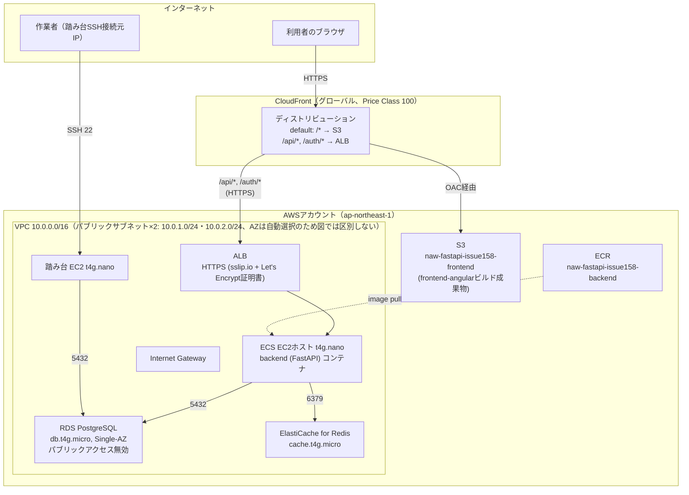
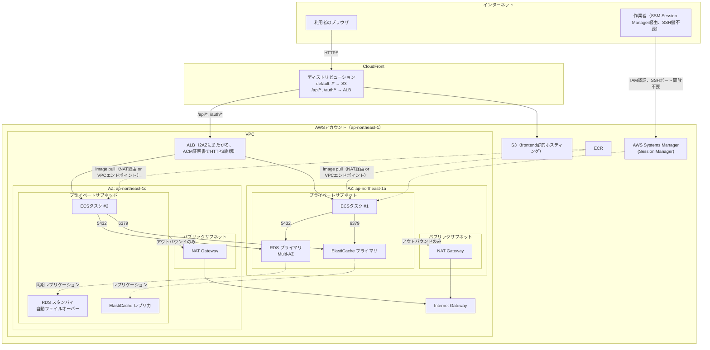

# architecture

## 今回の構成（Issue #158、コスト最小化・単一障害点あり）

- 実線: アプリケーションの通信経路
- 点線: イメージのpull等、随時発生する通信
- プライベートサブネットは作らず、パブリックサブネットのみでNAT Gatewayを不要にしている（詳細は`02_基本設計.md`「ネットワーク構成の方針」参照）
- セキュリティグループの詳細なルールは`02_基本設計.md`「ネットワーク構成の方針」章を参照
- ALB以外はすべて単一インスタンス（ECS 1台・RDS Single-AZ・ElastiCacheレプリカ0・踏み台1台）で、冗長性はない

---

## ベストプラクティス構成（本番相当・参考）

今回は採用していないが、本番環境であれば一般的にこうする、という構成の参考図。マルチAZ冗長化・プライベートサブネット化・NAT Gateway・踏み台の代わりにSSM Session Managerを使う、といった違いがある。

### 今回の構成との主な違い

| 観点 | 今回（Issue #158） | ベストプラクティス（本番相当） |
|---|---|---|
| ECS | 1台のみ | 2AZに複数タスクを分散 |
| RDS | Single-AZ | Multi-AZ（自動フェイルオーバー） |
| ElastiCache | レプリカ0 | レプリカあり（別AZ） |
| サブネット | パブリックのみ | パブリック（ALB/NAT）＋プライベート（アプリ/DB） |
| NAT Gateway | なし | 各AZに1つ（アウトバウンド用） |
| 管理アクセス | 踏み台EC2 + SSHキーペア | SSM Session Manager（SSHポート開放不要） |
| コスト | 検証1回あたり数十〜200円 | 月額数万円規模（NAT Gateway・Multi-AZ・複数台構成のため） |
