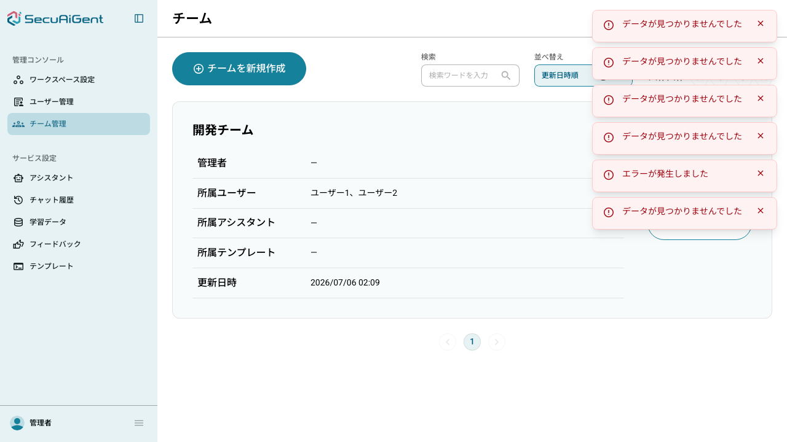

# 動作確認

## 前提条件

- `docker compose up -d`（postgres起動済み、追加操作なし）
- `cd backend && .venv/bin/python -m alembic upgrade head` でマイグレーション適用
- `docker exec -i naw-fastapi-postgres psql -U root -d postgres < backend/seed.sql` でシードデータ投入（`user01`・`user02`を追加）
- `cd backend && .venv/bin/python -m uvicorn app.main:app --port 8001` でバックエンドを起動
- `cd frontend-angular && npm start` で開発サーバーを起動（`http://localhost:4201`）
- 確認はヘッドレスブラウザ（Playwright）およびcurlを用いてClaude Codeが実施

---

## 自動テスト結果

```
$ .venv/bin/python -m pytest tests/ -q
132 passed, 111 warnings in 16.30s
```

新規追加した以下のテストを含め全件成功。

- `tests/integration/test_groups.py`（24件：`GET /api/groups`のisBelonged挙動、`GET /api/admin/groups`の権限別絞り込み、`GET /api/admin/all-groups`のテナント管理者専用制御、グループCRUDの権限チェック、所属ユーザーの追加・削除・ロール更新・冪等性・自己操作禁止）
- `tests/unit/test_group_service.py`（6件：`_assert_can_manage_group`・`_assert_not_self`の権限判定ロジック）

既存の102件のテストにも回帰がないことを確認した。

---

## API直叩きでの確認

### グループ作成

```
$ curl -s -X POST http://localhost:8001/api/admin/groups -H "Authorization: Bearer $TOKEN" -H "X-Tenant-ID: test-tenant" -H "Content-Type: application/json" -d '{"name":"開発チーム"}'

{"id":"5579fb5519d14465ad1de04ee164c3ad","name":"開発チーム","tenantId":"test-tenant","updatedAt":"2026-07-05T17:09:26.923451Z"}
```

### ユーザー追加

```
$ curl -s -i -X POST http://localhost:8001/api/admin/groups/{group_id}/users -H "Authorization: Bearer $TOKEN" -H "X-Tenant-ID: test-tenant" -d '{"userIds":["<user01-id>","<user02-id>"]}'

HTTP/1.1 204 No Content
```

### グループ所属ユーザー一覧（Spring Page形式であることを確認）

```
$ curl -s http://localhost:8001/api/admin/groups/{group_id}/users -H "Authorization: Bearer $TOKEN" -H "X-Tenant-ID: test-tenant"

{
    "content": [
        {"userId": "...-002", "name": "ユーザー1", "role": "USER", "groupAdmin": false, "updatedAt": "..."},
        {"userId": "...-003", "name": "ユーザー2", "role": "USER", "groupAdmin": false, "updatedAt": "..."}
    ],
    "totalElements": 2,
    "number": 0,
    "size": 20
}
```

`response_model_exclude_none=True` により、ビリング関連フィールド（`totalCredits`・`usedTokens`等）がレスポンスから省略され、Spring版の`@JsonInclude(NON_NULL)`と同様の挙動になることを確認した。

### グループ一覧（data/total/page/size形式であることを確認）

```
$ curl -s "http://localhost:8001/api/admin/groups" -H "Authorization: Bearer $TOKEN" -H "X-Tenant-ID: test-tenant"

{
    "data": [
        {
            "id": "5579fb5519d14465ad1de04ee164c3ad",
            "tenantId": "test-tenant",
            "name": "開発チーム",
            "users": ["...-002", "...-003"],
            "adminUserIds": [],
            "adminUserNames": [],
            "userNames": ["ユーザー1", "ユーザー2"],
            "assistants": [], "assistantIds": [], "promptTemplates": [], "promptTemplateIds": [],
            "updatedAt": "2026-07-05T17:09:26.923451Z"
        }
    ],
    "total": 1, "page": 0, "size": 20
}
```

2系統のレスポンス形式（グループ一覧は`data/total/page/size`、所属ユーザー一覧は`content/totalElements/number/size`）がいずれも`frontend-angular`の既存コード（`GroupApiResponse`型・`parseSpringPage`）が期待する契約通りであることを確認した。

---

## ブラウザでの実機確認（Playwright）

`http://test-tenant.localhost:4201/` で `admin`／`admin@1234` でログイン後、`/admin/groups`（チーム管理画面）にアクセス。



- 作成した「開発チーム」が一覧に表示された
- 所属ユーザーとして「ユーザー1、ユーザー2」が正しく表示された（API直叩きで追加したデータがそのまま画面に反映されている）
- 管理者欄は「−」（未設定のため空、想定通り）

画面右上のエラートースト（「データが見つかりませんでした」等）は、`GET /api/assistants`・`GET /api/admin/assistants`・`GET /api/admin/prompt-templates`・`GET /api/rooms`（いずれも未実装、別スコープ）と、`GET /api/admin/users`の422（既存のUsers機能側の不具合、本チケットのスコープ外）によるもので、グループ機能自体とは無関係であることを確認した。

グループ名クリックによる詳細画面への遷移は、本確認では発生しなかった（一覧表示以外のUI操作は未確認）。所属ユーザー一覧・追加・削除・ロール更新のAPI契約自体は自動テストとcurl直叩きで検証済みのため、UI操作の詳細確認は必要であればユーザー側でも実施可能。

---

## 結論

- グループのCRUD・所属ユーザー管理（追加・削除・ロール更新）・権限モデル（テナント管理者／グループ管理者／一般ユーザー）が仕様通り動作することを自動テスト・API直叩きで確認した
- `frontend-angular`の既存実装が期待するレスポンス形式（2系統）に正しく適合していることを確認した
- グループ管理画面の一覧表示が実際に動作することをブラウザで確認した
