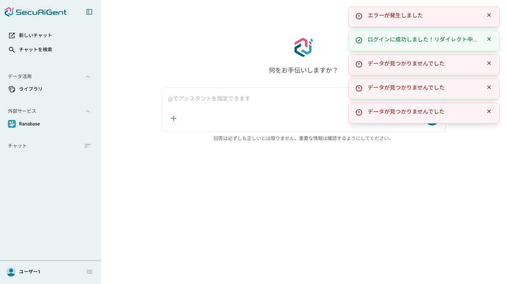

# 動作確認

## 前提条件

- `docker compose up -d`（postgres起動済み、追加操作なし）
- `cd backend && .venv/bin/python -m alembic upgrade head` でマイグレーション適用
- `docker exec -i naw-fastapi-postgres psql -U root -d postgres < backend/seed.sql` でシードデータ投入（動作確認用グループ・アシスタント・紐付けを追加）
- `cd backend && .venv/bin/python -m uvicorn app.main:app --port 8001` でバックエンドを起動
- `cd frontend-angular && npm start` で開発サーバーを起動（`http://localhost:4201`）
- 確認はヘッドレスブラウザ（Playwright）およびcurlを用いてClaude Codeが実施

---

## 自動テスト結果

```
$ .venv/bin/python -m pytest tests/ -q
141 passed, 127 warnings in 16.37s
```

新規追加した`tests/integration/test_assistants.py`（5件：所属グループのアシスタント取得、未所属時の空配列、2グループ経由での重複排除、無関係グループのアシスタント除外、未認証401）を含め全件成功。既存136件にも回帰なし。

---

## API直叩きでの確認

```
$ curl /api/assistants -H "Authorization: Bearer <user01のトークン>" -H "X-Tenant-ID: test-tenant"
[
    {
        "id": "10000000000040008000000000000001",
        "tenantId": "test-tenant",
        "type": "SAAS_CHAT",
        "endpoints": [],
        "name": "汎用アシスタント",
        "indexId": null,
        "groups": ["20000000000040008000000000000001"],
        "category": null,
        "categories": [],
        "description": "一般的な質問に回答するアシスタント",
        "includeHistory": true,
        "iconColor": null
    }
]

$ curl /api/assistants -H "Authorization: Bearer <user02のトークン>" -H "X-Tenant-ID: test-tenant"
[]
```

`user01`（動作確認用グループ所属）はアシスタントが1件返り、`user02`（未所属）は空配列が返ることを確認した。

---

## ブラウザでの実機確認（Playwright）

`http://test-tenant.localhost:4201/` で `user01`／`user01@1234` でログイン後、ダッシュボードにアクセス。



観測されたAPI呼び出し:

```
200 GET http://test-tenant.localhost:4201/api/assistants
```

issue-20の動作確認時に404だった`GET /api/assistants`が200になったことを確認した。画面右上に残るエラートーストは`/api/rooms`・`/api/prompt-templates`等の未実装エンドポイント（別スコープ）によるもので、アシスタント機能とは無関係。

---

## 結論

- Group紐づけによるアシスタント一覧のフィルタリング・重複排除が仕様通り動作することを自動テスト・API直叩きで確認した
- issue-20で報告されていた`GET /api/assistants`の404が解消されたことをブラウザで確認した
